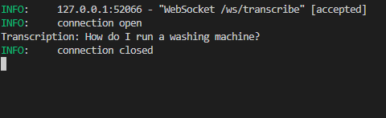
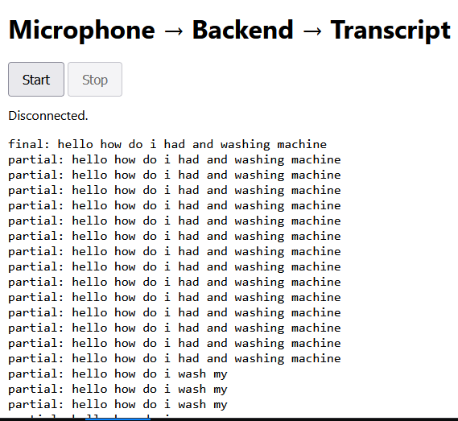

### **Objective:** 

Capture **real-time voice queries** from the user and convert them into text before passing them to the retrieval pipeline.

#### **Two practical options:**

1. **Use OpenAI Realtime API** ( whisper recommended for quality). [[STT theory]]
2. **Use local libraries like Vosk** (works offline). [[STT theory]]
---

> [!NOTE]
> Install   ffmpeg, this tool convert any video/audio file format to desired format and does more

### Steps

1. Install dependencies:
   ```bash
   pip install websockets sounddevice numpy whisper fastapi pydub
	 ```

2. Run server file and open static whisper_index.html page
```bash
uvicorn whisper_server:app --reload
```

Result:



#### To run vosk:

Load ASR model (download once from: https://alphacephei.com/vosk/models)

1. Install dependencies:
   ```bash
   pip install vosk 
   ```

2. Run server file and open static vosk_index.html page
```bash
uvicorn vosk_server:app --reload
```
3. Results are not impressive using vosk:



